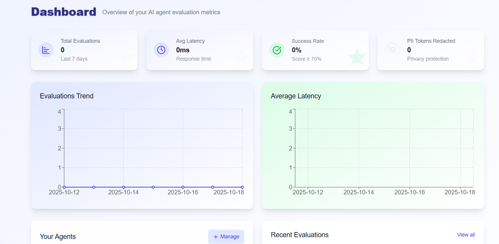
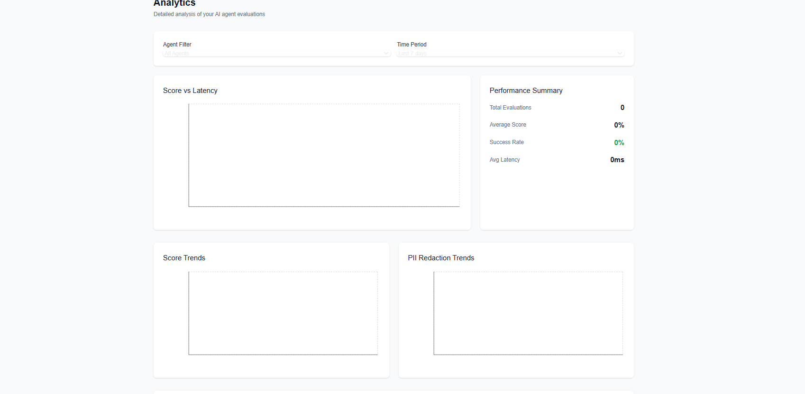

# AI Agent Evaluation Framework

A self-service web application built with Next.js, React, and Supabase for evaluating AI agent performance. This platform allows users to manage AI agents, ingest evaluation data, and visualize performance metrics through interactive dashboards.




## 🚀 Features

### Core Functionality
- **Multi-tenant Architecture**: Each user sees only their own data with Rgit ow Level Security (RLS)
- **Agent Management**: Create, update, and delete AI agents with custom configurations
- **Evaluation Ingestion**: REST API for ingesting evaluation results from your AI systems  
- **Interactive Dashboards**: Real-time charts and KPIs for performance monitoring
- **Advanced Analytics**: Drill-down views with detailed evaluation analysis
- **PII Protection**: Configurable PII obfuscation for privacy compliance

### Agent Configuration Settings
- **Run Policy**: Always evaluate or sample-based evaluation
- **Sample Rate**: Configurable percentage for sampled evaluations (0-100%)
- **PII Obfuscation**: Enable/disable personally identifiable information masking
- **Rate Limiting**: Max evaluations per day limit

### Dashboard & Analytics
- 📊 **Performance KPIs**: Success rate, average latency, total evaluations
- 📈 **Trend Analysis**: 7/30/90-day performance trends
- 🔍 **Drill-down Views**: Detailed evaluation inspection with PII masking
- 📋 **Pagination**: Efficient handling of large datasets (20,000+ evaluations)
- 🎯 **Filtering**: Filter by agent and time period

## 🛠 Tech Stack

- **Frontend**: Next.js 14 (App Router), React, Tailwind CSS
- **Backend**: Next.js API Routes, Supabase (PostgreSQL)
- **Authentication**: Supabase Auth with RLS
- **Charts**: Recharts
- **Icons**: Lucide React
- **Language**: JavaScript (ES6+)

## 📋 Prerequisites

- Node.js 18+ and npm
- Supabase account and project
- Git

## 🚀 Quick Start

### 1. Clone and Install

```bash
git clone <repository-url>
cd ai-agent-evaluation
npm install
```

### 2. Environment Setup

Create `.env.local` file:

```env
# Supabase Configuration
NEXT_PUBLIC_SUPABASE_URL=your-supabase-project-url
NEXT_PUBLIC_SUPABASE_ANON_KEY=your-supabase-anon-key
SUPABASE_SERVICE_ROLE_KEY=your-supabase-service-role-key
```

### 3. Database Setup

1. **Create Supabase Project**: 
   - Go to [supabase.com](https://supabase.com)
   - Create a new project
   - Copy your project URL and keys to `.env.local`

2. **Run Database Schema**:
   - Go to your Supabase project dashboard
   - Navigate to SQL Editor
   - Run the contents of `supabase-schema.sql`

### 4. Seed Test Data (Optional)

Generate realistic test data:

```bash
npm run seed
```

This creates:
- Test user account (credentials displayed in console)
- 4 sample AI agents with different configurations
- 150+ synthetic evaluation records with realistic data

### 5. Start Development Server

```bash
npm run dev
```

Visit [http://localhost:3000](http://localhost:3000)

## 📖 Usage Guide

### Getting Started
1. **Sign Up**: Create an account at `/signup`
2. **Create Agent**: Add your first AI agent with evaluation settings
3. **Ingest Data**: Use the API to send evaluation results
4. **Monitor Performance**: View dashboards and analytics

### Agent Management

**Creating an Agent**:
```javascript
// Via UI or API
POST /api/agents
{
  "name": "My ChatBot",
  "description": "Customer support chatbot",
  "config": {
    "run_policy": "always",
    "sample_rate_pct": 100,
    "obfuscate_pii": true,
    "max_eval_per_day": 1000
  }
}
```

**Configuration Options**:
- `run_policy`: "always" or "sampled"
- `sample_rate_pct`: 0-100 (percentage of requests to evaluate)
- `obfuscate_pii`: true/false (mask PII in UI)
- `max_eval_per_day`: integer (rate limiting)

### Evaluation Ingestion

Send evaluation results to the platform:

```bash
curl -X POST http://localhost:3000/api/evals/ingest \
  -H "Content-Type: application/json" \
  -H "Authorization: Bearer YOUR_JWT_TOKEN" \
  -d '{
    "agent_id": "uuid-here",
    "interaction_id": "unique-interaction-id",
    "prompt": "What is the weather today?",
    "response": "I cannot access real-time weather data...",
    "score": 85,
    "latency_ms": 250,
    "flags": {"category": "weather", "confidence": 0.9},
    "pii_tokens_redacted": 0
  }'
```

**Required Fields**:
- `agent_id`: UUID of the agent
- `interaction_id`: Unique identifier for the interaction
- `prompt`: Input text sent to the AI agent
- `response`: Output text from the AI agent
- `latency_ms`: Response time in milliseconds

**Optional Fields**:
- `score`: Evaluation score (0-100)
- `flags`: JSON object with additional metadata
- `pii_tokens_redacted`: Number of PII tokens removed

### API Endpoints

| Method | Endpoint | Description |
|--------|----------|-------------|
| `GET` | `/api/agents` | List user's agents |
| `POST` | `/api/agents` | Create new agent |
| `GET` | `/api/agents/[id]` | Get agent details |
| `PUT` | `/api/agents/[id]` | Update agent |
| `DELETE` | `/api/agents/[id]` | Delete agent |
| `POST` | `/api/evals/ingest` | Ingest evaluation data |
| `GET` | `/api/evals` | List evaluations (paginated) |
| `GET` | `/api/metrics` | Get performance metrics |

### Dashboard Navigation

- **Dashboard** (`/dashboard`): Overview with key metrics and recent activity
- **Agents** (`/agents`): Manage AI agents and their configurations  
- **Analytics** (`/analytics`): Detailed performance analysis with charts
- **Settings** (`/settings`): User profile and preferences

## 🏗 Architecture

### Database Schema

**Core Tables**:
- `agents`: AI agent definitions
- `agent_configs`: Configuration settings per agent
- `evaluations`: Individual evaluation records

**Security**:
- Row Level Security (RLS) ensures data isolation
- User authentication via Supabase Auth
- API routes validate user ownership

### Performance Considerations

- **Pagination**: All lists support pagination for large datasets
- **Indexing**: Optimized database indexes for common queries
- **Caching**: Efficient data loading patterns
- **Batch Processing**: Evaluation ingestion supports batch operations

## 🔒 Security & Privacy

### Data Protection
- **Row Level Security**: Database-level isolation between users
- **PII Masking**: Configurable obfuscation in UI
- **Authentication**: Secure JWT-based auth with Supabase
- **Input Validation**: All API endpoints validate inputs

### Privacy Features
- Users control PII obfuscation per agent
- Evaluation data is private to each user
- No cross-tenant data access possible

## 🚀 Deployment

### Vercel Deployment

1. **Connect Repository**:
   - Import project to Vercel
   - Connect your GitHub repository

2. **Environment Variables**:
   - Add all `.env.local` variables to Vercel

3. **Deploy**:
   - Vercel will auto-deploy on push to main branch

### Database Migration
- Schema is in `supabase-schema.sql`
- Run in Supabase SQL Editor for production setup

## 📊 Performance Specs

- **Evaluation Capacity**: Handles 20,000+ evaluation records
- **Concurrent Users**: Multi-tenant with isolated data
- **API Response**: <200ms for typical queries
- **Batch Ingestion**: Support for bulk evaluation uploads

## 🧪 Testing

### Seed Data
```bash
npm run seed
```

Generates realistic test data including:
- Multiple agents with varied configurations
- Evaluation records spanning 30 days
- Realistic score distributions and latency patterns
- Sample flags and metadata

### Manual Testing
1. Create agents with different settings
2. Use the ingestion API to add evaluations
3. Verify data appears correctly in dashboards
4. Test filtering and pagination

## 🧪 Test Credentials

After running the seed script (`npm run seed`), the console will display a test user email and password. Use these credentials to log in to the deployed app:

```
Email: (see console output after seeding)
Password: testpassword123
```

## 🧬 Seeding the Database

To generate sample data for testing:

```bash
npm run seed
```
- This creates a test user, 4 agents, and 150+ evaluations per agent.
- Credentials are printed in the terminal after seeding.

## 🌐 Vercel Deployment

1. Push your code to a public GitHub repository.
2. Connect the repo to Vercel and set these environment variables:
   - `NEXT_PUBLIC_SUPABASE_URL`
   - `NEXT_PUBLIC_SUPABASE_ANON_KEY`
   - `SUPABASE_SERVICE_ROLE_KEY`
3. Deploy and test the app.
4. Create a test user (via seed or signup).
5. Add your deployed URL and test login below:

```
Deployed App: https://your-vercel-app-url.vercel.app
Test Login: (see above)
```

## 🤖 AI Tools Used

- GitHub Copilot: Used for code completion, refactoring, and generating boilerplate for React components, API routes, and Supabase queries.
- ChatGPT: Used for architecture brainstorming, error debugging, and code review suggestions.

## ✅ Submission Checklist

- [x] Multi-tenant Auth & RLS (Supabase Auth, RLS policies)
- [x] Agent config UI (run_policy, sample_rate_pct, obfuscate_pii, max_eval_per_day)
- [x] Evaluation ingestion API (`/api/evals/ingest`)
- [x] Dashboard with KPIs, trends, and real-time updates
- [x] Analytics/drill-down with PII masking and pagination
- [x] Seed script with realistic data
- [x] README with schema, RLS, setup, and usage
- [x] Public GitHub repo
- [x] Vercel deployment + test login
- [ ] (Optional) Loom demo video

---

**Built with ❤️ for AI evaluation and monitoring**
